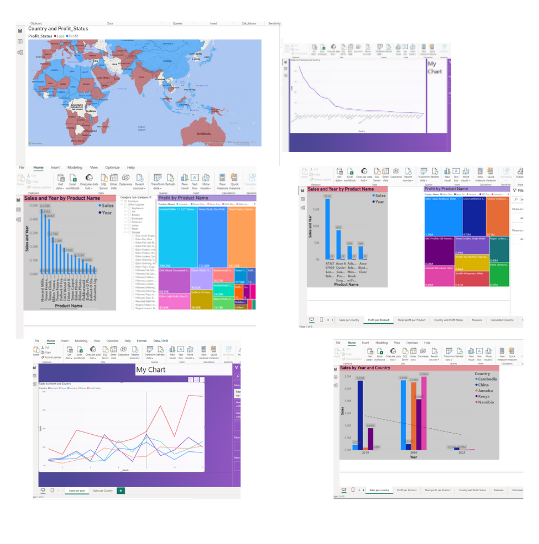

# Employee-Flight-Data-Analysis
Cleaning and visualizing employee flight data using Power BI.

## Overview

This project focuses on the cleaning, transformation, and visualization of employee flight data using Power BI. By utilizing Power BI's advanced features, such as the Power Query Editor and M language, we preprocess data, ensuring it's structured and ready for analysis. The ultimate goal is to derive actionable insights from the visualized data.

## Objectives

- Connect to various data sources and understand the structure of the business dataset.
- Clean and transform the dataset, including actions like removing N/A rows, unpivoting columns, splitting columns, and setting appropriate data types.
- Utilize the M language in Power BI for advanced data manipulations.
- Design and implement a Star Schema Model to optimize data storage and retrieval.
- Visualize cleaned data using various chart types and apply advanced formatting for clarity and understanding.

## Steps to Reproduce

1. **Connect to Data Source**: 
   - Initiate by connecting to the business dataset and other required data sources in Power BI.

2. **Data Cleaning**:
   - Remove N/A rows and designate the first row as header names.
   - Employ the Unpivot function, split columns, and set appropriate data types.
   - Rectify any data conversion errors.
   - Optimize performance by disabling loading of unused files.

3. **Data Transformation**:
   - Get acquainted with the M language in Power BI for advanced transformations.
   - Use operators like Pivot, Unpivot, Append, and Merge for reshaping data.
   - Define appropriate data types for each column.
   - Design a Star Schema Model encompassing Product, Segment dimensions tables, and a Fact Sales table.
   - Systematically organize datasets for ease of access.

4. **Data Visualization**:
   - Create diverse visuals to represent:
     - Sales per county.
     - Profit per product.
     - Slice profit per product.
     - Country and profit status.
     - Time-series representation of sales per country 
     - Sales per year.
   
   
     
   - Implement filters, top N features, and slicers for enhanced data interactivity.
   - Enhance visuals with advanced formatting and add analytical lines for context.
   - Address any merging issues between queries to maintain data integrity.

5. **Final Touches**:
   - Apply advanced color formatting.
   - Construct measures in Power BI Desktop for dynamic calculations.

## Results

- A comprehensive Power BI dashboard that elucidates employee flight data in an interactive manner.
- Transparent visuals elucidating patterns, anomalies, or other significant data points.

## Conclusion

This Power BI project adeptly transforms raw employee flight data into a structured, cleaned, and visual format, enabling stakeholders to make informed decisions, optimize operations, and delve deeper into employee flight patterns.

